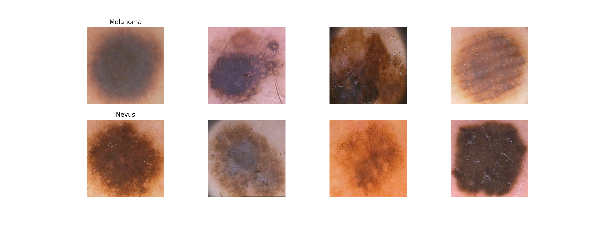

# Melanoma_Detection
We present an improved automated system for diagnosing skin cancers (melanoma) using deep learning techniques. 

Abstract:  we present an improved automated system for diagnosing skin cancers (melanoma) using deep learning techniques. We utilize a pre-trained deep CNN model (MobileNet) to extract visual features from dermoscopic images. Our method incorporates boundary localization and cropping to generate more relevant features. Skin lesion classification is performed using a set of classifiers. Validation on the PH2 dataset demonstrates promising performance, outperforming state-of-the-art methods.

Introduction

Melanoma is the most deadly form of skin cancer and has risen rapidly across the globe. Hence, early diagnosis of melanoma is of great significance for timely treatment and healthy living. This disease unexpectedly causes signs on normal skin with a dark mole and an irregular border. Figure  shows sample dermoscopic images from melanoma and non-melanoma categories.

